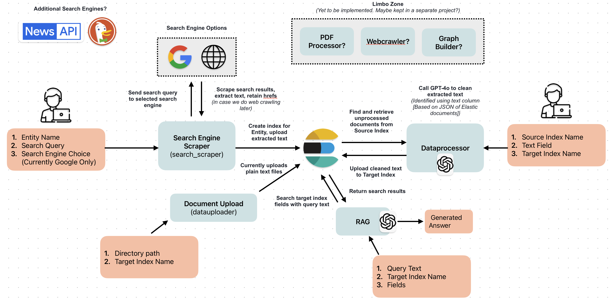

# Hound

Conduct searches using a search engine API. Scrape the results, extract the text, use an LLM to clean the text, and upload it to Elastic.
Intention for this project was to be the first part of a more complex and complete pipeline, so it is just data collection and initial processing. 
This is an early stage project.

Goal: To perform research on a particular entity, and aggregate surface-level information found into an elasticsearch index, where it can be further processed. 

## Flow Diagram



## Ideas for further development:

1) Integrate other search engine options like DuckDuckGo
2) Make use of search engine targeted at news or academic articles
3) Introduce processing of PDFs, word docs, etc... 
4) Improve filtering of articles to prevent wasted LLM utilization 
5) Improve data cleaning to capture more detailed metadata?
6) Centralize logging with logstash 
7) Improve code comments and in-line documentation

## Setup

Project developed on python 3.12.4

This project does assume that you have the following resources available:

* An elastic cloud deployment
* A Google custom search engine and its API credentials
* An Azure OpenAI model deployment

Recommended first step is to create and activate a virtual env, then install all dependencies. 
```
python -m venv myenv
# MacOS
source myenv/bin/activate
# Windows
myenv\Scripts\activate 
pip install -r requirements.txt
```
The following credentials are required, so please create a .env file and fill it out with the appropriate values:

```
ELASTIC_CLOUD_ENDPOINT=""
ELASTIC_CLOUD_ID=""
ELASTIC_CLOUD_AUTH=""
ELASTIC_USERNAME=""
ELASTIC_PASSWORD=""
GOOGLE_SE_API_KEY=""
GOOGLE_SE_ID=""
AZURE_OPENAI_KEY_1=""
AZURE_OPENAI_KEY_2=""
AZURE_OPENAI_REGION=""
AZURE_OPENAI_ENDPOINT=""
AZURE_OPENAI_DEPLOYMENT_NAME=""
```

And that should be it! Use the commands below to get started. 

## To Run:

### Search Scraper
* Arg 1: The entity you want to research. Collected docs will be saved to an index "raw__{entity}"
* Arg 2: The search engine query.
```
python3 ./search_scraper/run.py govtech "govtech sg significance"
```

### Data Processor
* Arg 1: The elastic index from which you will pull your documents for cleaning. 
* Arg 2: The column or property containing the text you'd like to clean.
* Arg 3: The elastic index which cleaned documents will be saved to. 
```
python3 ./dataprocessor/run.py raw__govtech all_text processed__govtech
```

